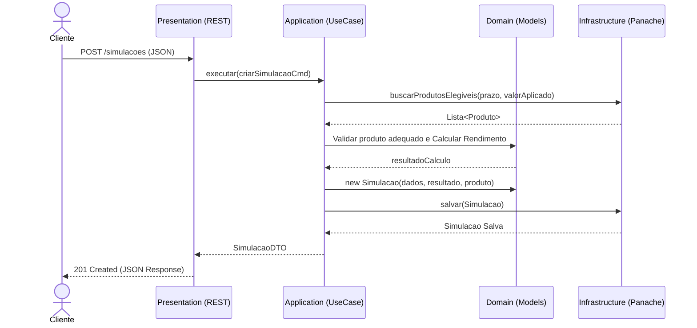
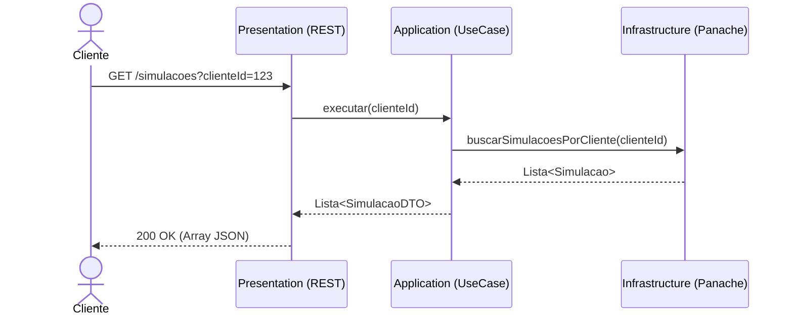

# Simulador de Investimentos - CAIXA

Este é o projeto para o Desafio Técnico Back-end da CAIXA, construído seguindo os padrões da **Clean Architecture**, além de contar com a stack **Java 21 + Quarkus + SQLite**.

> 💡 **Para o Avaliador:** O projeto foi configurado com Docker para poupar o seu tempo. Você **não precisa** ter Java, Maven ou SQLite instalados em sua máquina para rodar ou testar o projeto. **Basta ter o Docker!**

---

## 🚀 Como Rodar o Projeto (A Forma Mais Fácil)

O projeto possui um `Dockerfile` multi-stage que compila o código fonte e gera a imagem de execução de forma totalmente isolada.

Abra seu terminal na raiz do projeto e execute:

```bash
docker compose up --build
```

*(Ou `docker-compose up --build` dependendo da sua versão do Docker).*

Pronto! A API estará rodando em `http://localhost:8080`.
*(Na primeira vez pode levar alguns minutos para o Docker baixar as camadas do Maven e compilar).*

---

## 💻 Testando a API (Copiar e Colar)

Abra outro terminal e rode os `curl` abaixo para validar imediatamente o sistema:

### 1. Criar uma Simulação (POST)

```bash
curl -X POST http://localhost:8080/simulacoes \
  -H "Content-Type: application/json" \
  -d '{
    "clienteId": 12345,
    "valor": 10000.00,
    "prazoMeses": 12,
    "tipoProduto": "CDB"
  }'
```

*Obs: A tabela de produtos é populada automaticamente com opções de `CDB`, `LCA` e `LCI` no momento em que a aplicação sobe (Migration via Flyway).*

### 2. Buscar o Histórico de Simulações (GET)

```bash
curl -X GET "http://localhost:8080/simulacoes?clienteId=12345"
```

---

## 🧪 Como Rodar os Testes Automatizados (Opcional)

A cobertura de testes do projeto já ultrapassa os **80%** exigidos (alcançando ~90%). 

Caso você tenha **Java 21 e Maven** instalados na sua máquina e deseje rodar os testes localmente para validar a cobertura e as asserções:

```bash
mvn clean test
```

---

## 🏗 Arquitetura e Decisões Técnicas (Clean Architecture Padrão CAIXA)

Para se alinhar à padronização e excelência técnica das aplicações já desenvolvidas na **CAIXA**, este projeto foi construído utilizando a **Clean Architecture** (Arquitetura Limpa), impulsionada pelas tecnologias **Java (Quarkus)** e **Hibernate com Panache**.

Essa escolha arquitetural garante os seguintes benefícios corporativos:
- **Intocabilidade da Regra de Negócio (Domain):** As regras vitais de negócio (como os cálculos de rentabilidade das simulações) ficam totalmente independentes do framework (Quarkus) ou do ecossistema de dados externo.
- **Inversão de Dependência:** O acesso ao banco de dados utilizando *Hibernate Panache* via padrão Repository, assim como a disponibilização de endpoints web, operam isolados nas margens da aplicação (`Infrastructure` e `Presentation`). O domínio dita as regras por meio de contratos (interfaces).
- **Testabilidade Aprimorada:** Casos de uso (`Application`) e lógicas de domínio podem ser testados unitariamente de forma rápida e eficiente, sem o peso de inicialização de conexões com banco de dados ou do container corporativo.

Abaixo está o gráfico da estrutura de pastas representando as 4 camadas fundamentais do projeto:

```text
src/main/java/gov/caixa/
├── application/         # Casos de uso que orquestram os fluxos (Application Business Rules)
│   └── usecase/
├── domain/              # Núcleo inalterável (Enterprise Business Rules)
│   ├── exception/
│   ├── model/           # Entidades centrais (Produto, Simulacao)
│   ├── repository/      # Contratos (Interfaces)
│   └── valueobject/
├── infrastructure/      # Motores de persistência e implementações técnicas (Frameworks & Drivers)
│   └── persistence/
│       ├── converter/
│       ├── entity/      # Entidades JPA
│       ├── mapper/      # MapStruct (Entity <-> Domain)
│       └── repository/  # PanacheRepository implementando os contratos do Domain
└── presentation/        # Controladores REST e entrada de requisições (Interface Adapters)
    ├── controller/      # RESTEasy
    ├── dto/             # Objetos de transferência de dados (Request/Response)
    └── exception/       # Exception Mappers globais
```

### 🔄 Fluxos da Aplicação (Diagramas de Sequência)

Para facilitar o entendimento de como as camadas se comunicam, abaixo estão os fluxos das duas principais funcionalidades da API:

#### 1. Criar Simulação (`POST /simulacoes`)



#### 2. Buscar Histórico (`GET /simulacoes?clienteId={id}`)



## ✨ Extras (Bônus Implementados)

Conforme sugerido no desafio, adicionei:
- **Dockerfile** simplificado multi-stage na raiz do repositório.
- **Docker Compose** para 1-click run.
- Histórico completo no Git refletindo as camadas do desenvolvimento.

Se chegou até aqui, muito obrigado por avaliar meu código!
